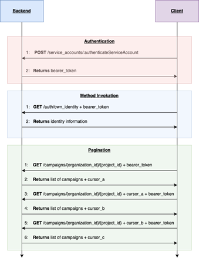

# CarNeoClient
## Table of Contents
1. [Introduction](#introduction)
2. [How To Use](#how-to-use)
3. [To Dos](#to-dos-&-plans)

## Introduction
This repository contains a client application & libary for the CarNeo system to provide a minimal set of functionality to other developers. <br>
The client application communicates with the CarNeo backend via REST mechanisms (See: https://api.dev.carneo.cloud/docs). <br>

## How To Use
Python 3.4 or higher is required. Tested on MacOS 12.6.6 & Ubuntu 20.04.3 LTS. <br>
1. Open your IDE (e.g. VSC), open a new terminal and clone this repository: <br>
    ```bash 
    git clone -b main https://github.com/kianwasabi/CarNeoClient.git 
    ```
2. Navigate to the projects root directory and set permissions on setup.sh. 
    ```bash
    cd CarNeoClient
    chmod +x setup.sh
    chmod u+rwx setup.sh
    ``` 
3. The setup.sh installs all required dependencies & activate the venv. <br>
    ```bash
    ./setup.sh
    ``` 
    **Note:** The needed dependencies will be installed in venv in the project's root directory. The shell script should activate the venv automatically. If not, ensure to activate the venv to grant the libary needed dependencies. <br>
    **Note:** A text file named "private_key.txt" will be created in the root directory. You can store your client's private key for the JWT token there. Please ensure to keep your keys secure, even though the .gitignore file will ignore all .txt files. 

3. Run the example client application by executing the following command: <br>
    ```bash 
    python3 example.py
    ```

## Project Status
### Project Status:
- Still in Development. Estimated: 75% done. <br>

### To Dos:
  - [x] Authentification 
  - [x] Check Identity 
  - [x] Call „Campaigns“ for organization & project
  - [x] Call specific “Campaign” by CampaignID
  - [x] Create a „project“
  - [] Use .pem instead of .txt for private key
  - [x] Authentification
  - [x] Check Identity
  - [x] Call „Campaigns“ for organization & project
  - [x] Call specific “Campaign” by CampaignID
  - [] Create a „project“

**Note**: No Issue/Ticket-System in use. Specific to do's are in the code. <br>

<!---
### Questions:
01.07.2024
Authentification: <br>
- Requirements for JWT (auth_token)? <br>
    - Which Encoding Method for private key?  <br>
    - Is "key" (UUID) in init-token payload the server public-key? I need the public key for testing :) <br>
    - "3fa85f64-5717-4562-b3fc-2c963f66afa6" (see API Doc UUID) surrficiant for testing?  <br>
    -> UUIDs haben keine spezielle Kodierung.
- Pragnation: 
    - "3fa85f64-5717-4562-b3fc-2c963f66afa6" (see API Doc UUID) surrficiant for testing?  <br>
    - Kurze Erklärung zum allgemeinem Use-Case der API: Annahme aus API Doku - Handelt es sich um eine "Auftragsverwaltung"? z.B. ein ID.Buzz Client kann mehrere (bis zu 25) Aktionen (**Campaigns**) ausführen, die dem **Project** MOIA zugeordnet sind und Teil der **Organization** Volkswagen sind?
    -> Ja.
02.07.2024
- Welches expliziten Casts brauchen die Claims? Beispiel vorliegend? 
- Wie lautet der Public Key?
- Mit welchem Alorithmus decodiert der Server den JWT-Token?

- Pargination: Nur Vorwärts 


## Notes 
Für unser CarNEO-System stellen wir eine REST API zu Verfügung. <br>
Für die API soll ein Client entwickelt werden, der einen Minimalumfang von Funktionalität anderen Entwicklern zur Verfügung stellt. <br>
1. Authentifizierung
2. Abruf der eigenen Identität (GET /auth/own_identity)
3. Abruf der „Campaigns“ nach Organization und Project
4. Abruf einer einzelnen “Campaign” unter Zuhilfenahme der CampaignID
5. Erstellen eines „Projects“
 
Mit dem Begriff „Client“ ist keine UI gemeint, sondern Klassen bzw. eine Library, die von Entwicklern in ihrem Programm genutzt werden können. <br>
 
Die Kommunikation mit dem Backend erfolgt über REST-Mechanismen:



Die Authentifizierung erfolgt über einen Token-Exchange: <br>
Das Backend speichert einen Public-Key und der Client speichert einen Private-Key. <br>
Der Client muss mit dem Private-Key einen JWT-Token erzeugen und an das Backend schicken (Initialtoken). <br>
Anschließend erhält der Client einen Token, das für die restlichen API-Calls verwendet werden kann. <br>
 
Die Payload des Initialtokens beinhaltet die folgenden Claims:
- „org“: Eine UUID, die einer Organisation in dem System zugeordnet ist.
- „acc“: Eine UUID, die einem Account in dem System zugeordnet ist.
- „key“: Eine UUID, die einem Public-Key in dem System zugeordnet ist.
- „iat“: Zeitstempel der Token-Erstellung
- „exp“: Zeitstempel an dem der Token ungültig wird (Max 1 Stunde)
 
Dieser Client soll in einer Programmiersprache Ihrer Wahl entwickelt werden. Die Nutzung von Dependencies ist zulässig, die Nutzung eines Code-Generators nicht.
 
Eine Dokumentation der REST-API kann hier eingesehen werden: https://api.dev.carneo.cloud/docs 

--->
